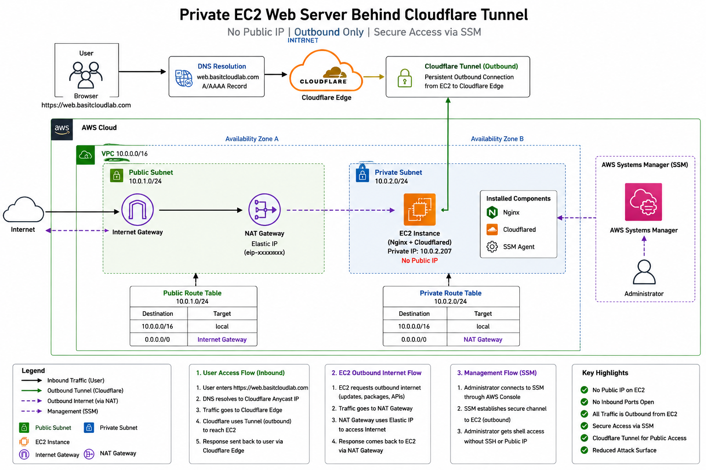

# AWS Secure Private Web Server with Cloudflare Tunnel

## Project Overview

This project demonstrates how to deploy a web server on a **private Amazon EC2 instance** without assigning a public IP address while still making the application accessible from the internet using **Cloudflare Tunnel**.

This project improves upon a previous deployment where the EC2 instance was located in a public subnet and directly accessible from the internet.

In this version:

- EC2 is deployed in a private subnet
- No public IP address is assigned
- SSH access is not required
- AWS Systems Manager (SSM) is used for administration
- NAT Gateway provides outbound internet access
- Cloudflare Tunnel securely publishes the application
- Nginx serves the web application

This architecture follows modern cloud security practices by minimizing the public attack surface.

---

# Problem Statement

In many beginner AWS deployments:

```text
Internet
   |
   |
Public EC2
   |
   |
Nginx
```

Although functional, this architecture exposes the EC2 instance directly to the internet.

Risks include:

- Public IP exposure
- SSH attack attempts
- Open inbound ports
- Larger attack surface

The goal of this project was to eliminate direct internet access to the server while maintaining website availability.

---
## Architecture Diagram



# Solution Architecture

```text
                        Internet Users
                               |
                               |
                               v
                    web.basitcloudlab.com
                               |
                               |
                               v
                        Cloudflare DNS
                               |
                               |
                               v
                      Cloudflare Edge
                               |
                               |
                               v
                    Cloudflare Tunnel
                               |
                               |
                               v
 -------------------------------------------------
 |                 AWS VPC                        |
 |                                                |
 |   Private Subnet                               |
 |                                                |
 |   +------------------------+                   |
 |   |     EC2 Instance       |                   |
 |   |        Nginx           |                   |
 |   |      No Public IP      |                   |
 |   +------------------------+                   |
 |                                                |
 -------------------------------------------------
               |
               |
               v
        NAT Gateway (Public Subnet)
               |
               |
               v
           Internet
```

---

# Architecture Components

## Amazon VPC

A dedicated VPC was created to isolate network resources.

### CIDR Block

```text
10.0.0.0/16
```

---

## Public Subnet

Used only for:

- NAT Gateway
- Internet connectivity services

No application workloads were hosted here.

---

## Private Subnet

Used for:

- Nginx Web Server
- Cloudflared Connector

The EC2 instance received only a private IP address.

Example:

```text
10.0.2.207
```

---

## Internet Gateway

Attached to the VPC to provide internet connectivity for public resources.

Used by:

```text
Public Subnet
|
NAT Gateway
```

---

## NAT Gateway

The NAT Gateway was deployed in the public subnet and assigned an Elastic IP.

Purpose:

- Allow private EC2 outbound internet access
- Install software updates
- Download packages
- Communicate with Cloudflare
- Reach AWS APIs

Without exposing the EC2 instance directly to the internet.

---

## Elastic IP

Attached to:

```text
NAT Gateway
```

Not attached to:

```text
EC2 Instance
```

Important distinction:

The Elastic IP provides outbound internet access only.

Browsing directly to the NAT Gateway Elastic IP does not expose the web server.

---

## EC2 Instance

Configuration:

```text
Amazon Linux
t2.micro
Private Subnet
No Public IP
```

Installed software:

```text
Nginx
Cloudflared
SSM Agent
```

---

## IAM Role

An IAM Role was attached to the EC2 instance.

Permissions enabled:

```text
AmazonSSMManagedInstanceCore
```

This allowed AWS Systems Manager to manage the instance securely.

---

## AWS Systems Manager (SSM)

Instead of SSH access:

```text
Admin
  |
  |
  v
AWS Systems Manager
  |
  |
  v
Private EC2
```

Benefits:

- No SSH keys required
- No bastion host required
- No inbound port 22
- Secure browser-based administration

---

## Cloudflare Tunnel

Cloudflare Tunnel was used to securely expose the application.

Tunnel flow:

```text
EC2
 |
 | Outbound Connection
 |
 v
Cloudflare Edge
```

No inbound connection from the internet to the EC2 instance was required.

---

## Nginx

Nginx served the website hosted on the private EC2 instance.

Example page:

```html
<h1>Private EC2 Behind Cloudflare Tunnel</h1>
<h2>No Public IP Address</h2>
<h3>Built by Syed Aftab</h3>
```

---

# Traffic Flow

## User Access Flow

```text
User Browser
      |
      v
web.basitcloudlab.com
      |
      v
Cloudflare DNS
      |
      v
Cloudflare Edge
      |
      v
Cloudflare Tunnel
      |
      v
Private EC2
      |
      v
Nginx
```

---

## Administrative Access Flow

```text
Administrator
       |
       v
AWS Systems Manager
       |
       v
Private EC2
```

No SSH required.

---

## Outbound Internet Flow

```text
Private EC2
       |
       v
NAT Gateway
       |
       v
Internet
```

Used for:

- Package installation
- Updates
- Cloudflare communication

---

# Security Improvements

| Previous Project | Current Project |
|-----------------|----------------|
| Public EC2 | Private EC2 |
| Public IP Assigned | No Public IP |
| Internet Accessible | Hidden from Internet |
| Traditional Access | SSM Access |
| Larger Attack Surface | Reduced Attack Surface |
| Direct Exposure | Cloudflare Tunnel |

---

# Validation Performed

### Verified No Public IP

AWS Console showed:

```text
Public IPv4 Address: -
```

---

### Verified Website Accessibility

Successfully accessed:

```text
https://web.basitcloudlab.com
```

---

### Verified Cloudflare Tunnel

Tunnel Status:

```text
Healthy
Connected
```

---

### Verified NAT Functionality

Private EC2 successfully:

- Installed Nginx
- Downloaded Cloudflared
- Accessed external repositories

without a public IP.

---

# Screenshots

### Architecture Build Process

- VPC Creation
- Public Subnet Creation
- Private Subnet Creation
- Route Table Configuration
- NAT Gateway Deployment
- EC2 Launch
- IAM Role Attachment
- SSM Session Access
- Cloudflare Tunnel Configuration

### Validation Screenshots

- EC2 showing **No Public IPv4 Address**
- Healthy Cloudflare Tunnel
- Published Application Route
- Working Website
- Website and Private EC2 visible in same screenshot

---

# Skills Demonstrated

- AWS VPC Design
- Public vs Private Subnets
- Route Tables
- Internet Gateway
- NAT Gateway
- Elastic IP
- IAM Roles
- AWS Systems Manager (SSM)
- Amazon EC2
- Nginx
- Cloudflare Tunnel
- DNS Routing
- Cloud Security
- Linux Administration
- Network Architecture

---

# Key Takeaways

This project demonstrates how to securely host an internet-accessible application without assigning a public IP address to the server.

By combining:

- Private Subnets
- NAT Gateway
- IAM Roles
- AWS Systems Manager
- Cloudflare Tunnel

the architecture achieves secure remote administration, outbound internet connectivity, and public web access while minimizing exposure to internet-based attacks.

Unlike traditional deployments, the web server is never directly exposed to the internet, significantly reducing the attack surface while maintaining full functionality.

---

# Resume Bullet

Designed and deployed a secure AWS web hosting architecture using a private EC2 instance, NAT Gateway, IAM Roles, AWS Systems Manager, Nginx, and Cloudflare Tunnel, enabling public website access without exposing the server through a public IP address.
